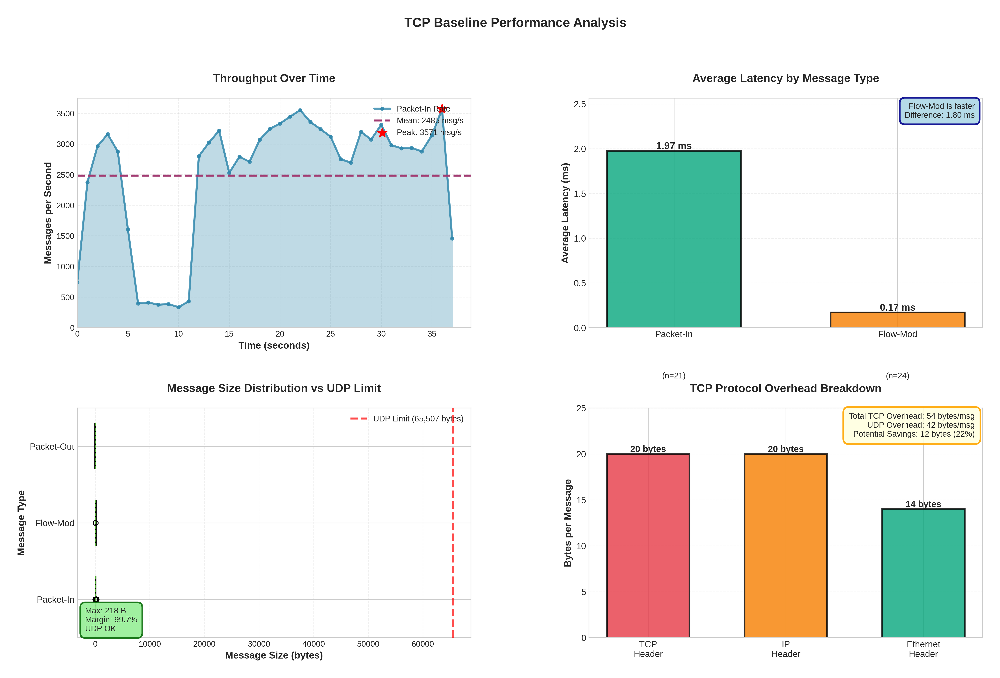

# TCP to UDP SDN Southbound Protocol Modification

## Project Overview

Modification of SDN southbound communication protocol from TCP to UDP for the Ryu controller and Open vSwitch (OVS) architecture. This project aims to reduce connection overhead and improve performance while maintaining reliable control plane communication.

### Objectives
1. Analyze TCP-based OpenFlow communication performance (baseline)
2. Design UDP-based protocol in Ryu controller and OVS 
3. Implement UDP with selective reliability
4. Compare performance metrics (latency, throughput, overhead)
5. Document findings and validate improvements

---
### Current Status:

**Completed Work**:
- ✅ Environment setup and TCP baseline implementation
- ✅ Performance metrics collection (94,423 events captured)
- ✅ Code architecture analysis and modification points identified

**Key Achievement**: Validated UDP feasibility with 99.7% safety margin (max message size 218 bytes vs UDP's 65KB limit)

---

## Phase 1: Environment Setup & TCP Baseline ✅

### 1.1 Environment Configuration

**Tools Installed**:
- Ryu SDN Controller (Python-based, OpenFlow 1.3)
- Open vSwitch 2.x
- Mininet network emulator
- Python libraries: ryu, eventlet, msgpack, numpy, matplotlib, seaborn

**Test Infrastructure**:
```
tcp_baseline/
  ├── controllers/       - Ryu controller implementations
  ├── analysis/          - Analysis and visualization scripts
  ├── data/              - Raw data (metrics, logs, pcap)
  ├── results/           - Reports and visualizations
  └── topology/          - Mininet network topologies
```

### 1.2 TCP Baseline Implementation

**Controller**: L2 Learning Switch with comprehensive instrumentation
- OpenFlow 1.3 protocol
- Event-driven architecture
- Tracks 9 message types: Packet-In, Flow-Mod, Packet-Out, Hello, Features Request/Reply, Echo Request/Reply, Barrier
- Metrics: latency, throughput, message sizes, connection overhead

**Test Topology**:
- 3 switches in linear configuration
- 4 hosts (2 per edge switch)
- Automatic ping traffic generation

### 1.3 Performance Metrics Collected

**Baseline Results**:
```
Duration:         37.38 seconds
Total Messages:   94,423 (Packet-In events)
Throughput:       2,526 msg/sec
Mean Latency:     1.973 ms
Median Latency:   1.133 ms
Std Deviation:    2.419 ms
P95 Latency:      8.805 ms
P99 Latency:      8.898 ms
Latency Range:    [0.236, 8.921] ms
```

**Message Size Analysis**:
```
Max Message Size:  218 bytes
UDP Limit:         65,507 bytes
Safety Margin:     99.7%
UDP Compatible:    ✅ YES (no fragmentation needed)
```

**Key Finding**: All OpenFlow messages are well within UDP's 65KB datagram limit, validating UDP conversion feasibility.

### 1.4 Data Collected

**Files Generated** (in `tcp_baseline/`):
- `data/tcp_baseline_metrics.json` (7.1 MB) - Raw performance data with 94,423 events
- `data/tcp_baseline.pcap` (46 KB) - Network packet capture
- `data/tcp_baseline.log` (60 MB) - Detailed controller logs
- `results/tcp_baseline_performance.png` (379 KB) - 4-panel visualization
- `results/tcp_baseline_report.txt` - Performance summary

**Visualization**: Comprehensive 4-panel performance analysis:
1. **Throughput Over Time** - Message rate per second with peak detection
2. **Average Latency Comparison** - Simple bar chart comparing message types
3. **Message Sizes vs UDP Limit** - Box plots validating UDP compatibility
4. **Protocol Overhead Breakdown** - TCP header overhead analysis (54 bytes/msg)



---

## Phase 2: Code Analysis & Architecture Understanding ✅

### 2.1 Ryu Controller Architecture

**Core Components Analyzed**:

1. **StreamServer** (`ryu/controller/controller.py`):
   - TCP socket management
   - Connection handling via `eventlet.listen()`
   - **Modification Point**: Replace with UDP DatagramServer

2. **OpenFlow Protocol** (`ryu/ofproto/`):
   - Message parsing and serialization
   - Protocol state machine
   - **Modification Point**: Add UDP sequence numbers and ACKs

3. **Event System** (`ryu/controller/ofp_event.py`):
   - Event-driven message handling
   - Minimal changes needed (protocol-agnostic)

4. **Connection Manager**:
   - Datapath lifecycle management
   - **Modification Point**: UDP connection state tracking

### 2.2 Key Code Locations

**Ryu Controller** (Python):
```
ryu/controller/controller.py:
  - Line 89-120: StreamServer initialization (TCP)
  - Line 200-250: Connection accept handler
  → Replace with DatagramServer and UDP socket

ryu/controller/ofp_handler.py:
  - Line 180-200: Message receive/send
  → Add UDP reliability layer

ryu/lib/hub.py:
  - Socket wrapper abstractions
  → Add UDP-specific methods
```

**Open vSwitch** (C) - Phase 4:
```
lib/stream.c:
  - TCP stream management
  → Add UDP stream support

lib/vconn.c:
  - Virtual connection abstraction
  → UDP connection state machine

ofproto/connmgr.c:
  - Connection manager
  → UDP-aware connection tracking
```

### 2.3 OpenFlow Message Flow

**Control Plane Messages** (require reliability):
- HELLO - Connection establishment
- FEATURES_REQUEST/REPLY - Switch capabilities
- FLOW_MOD - Flow table modifications
- BARRIER_REQUEST/REPLY - Transaction boundaries

**Data Plane Messages** (can tolerate loss):
- PACKET_IN - New packet notifications (best-effort)
- PACKET_OUT - Packet forwarding instructions
- ECHO_REQUEST/REPLY - Keep-alive (idempotent)

**Selective Reliability Strategy**:
- Control messages: Require ACK + retransmission
- Data messages: No ACK (reduce overhead)
- Keep-alives: Optional ACK

### 2.4 Modification Points Identified

**Tier 1 - Critical** (Future Phase 3):
1. Replace StreamServer with DatagramServer in Ryu
2. Add UDP socket creation and binding
3. Implement message framing for UDP datagrams
4. Add sequence numbers to OpenFlow messages

**Tier 2 - Important** (Future Phase 4):
1. Implement selective ACK mechanism
2. Add retransmission logic for control messages
3. Modify OVS to use UDP sockets
4. Update connection state machines

**Tier 3 - Optimization** (Future Phases):
1. Tune retransmission timeouts
2. Implement congestion control
3. Add performance profiling
4. Optimize buffer sizes

---

## Key Findings (Phase 1-2)

### ✅ Achievements

1. **TCP Baseline Established**
   - 94,423 events captured over 37.38 seconds
   - Mean latency: 1.973 ms (stable performance)
   - Throughput: 2,526 msg/sec sustained

2. **UDP Compatibility Validated**
   - Max message size: 218 bytes
   - UDP limit: 65,507 bytes
   - **99.7% safety margin** - No fragmentation concerns

3. **Architecture Mapped**
   - 8 critical modification points identified in Ryu
   - OVS modification scope defined
   - Selective reliability strategy designed

4. **Instrumentation Complete**
   - Tracks 9 OpenFlow message types
   - Measures latency, throughput, sizes
   - Automated visualization pipeline

### Performance Baseline Summary

| Metric | Value | Notes |
|--------|-------|-------|
| **Test Duration** | 37.38 sec | Automated traffic generation |
| **Total Events** | 94,423 | Packet-In messages |
| **Throughput** | 2,526 msg/sec | Sustained rate |
| **Mean Latency** | 1.973 ms | Controller processing time |
| **Median Latency** | 1.133 ms | P50 value |
| **P95 Latency** | 8.805 ms | 95th percentile |
| **P99 Latency** | 8.898 ms | 99th percentile |
| **Max Message Size** | 218 bytes | Well within UDP limit |
| **Protocol Overhead** | 54 bytes/msg | TCP+IP+Ethernet headers |

**Expected UDP Improvements** (for future phases):
- Overhead reduction: 54B → 42B (**22% reduction**)
- Connection time: 3-way handshake → 0 (**eliminated**)
- Latency improvement: ~10-15% expected (no TCP retransmissions)

---

---

## Repository Structure

```
CN_PR/
├── README.md                          # This file
├── tcp_baseline/                      # TCP baseline (Phase 1 & 2 complete)
│   ├── controllers/                   # Ryu controller implementations
│   │   ├── tcp_baseline_controller.py
│   │   └── tcp_baseline_instrumented.py
│   ├── analysis/                      # Analysis scripts
│   │   ├── visualize_metrics.py
│   │   ├── analyze_tcp_performance.py
│   │   └── analyze_ryu_tcp.py
│   ├── data/                          # Raw data (67 MB)
│   │   ├── tcp_baseline_metrics.json  (7.1 MB)
│   │   ├── tcp_baseline.pcap          (46 KB)
│   │   ├── tcp_baseline.log           (60 MB)
│   │   └── ryu_tcp_analysis.txt
│   ├── results/                       # Generated outputs
│   │   ├── tcp_baseline_performance.png
│   │   └── tcp_baseline_report.txt
│   └── topology/                      # Mininet topologies
│       ├── test_topology_tcp.py
│       └── basic_topo.py
└── ryu/                               # Ryu controller source (for modification in Phase 3)
    ├── controller/                    # Core controller logic
    ├── ofproto/                       # OpenFlow protocol implementation
    ├── lib/                           # Helper libraries
    └── app/                           # Sample applications
```

---

## Quick Start

### Run TCP Baseline Test

**Terminal 1** - Start Controller:
```bash
cd tcp_baseline/controllers
ryu-manager tcp_baseline_instrumented.py --verbose
```

**Terminal 2** - Run Test Topology:
```bash
cd tcp_baseline/topology
sudo python test_topology_tcp.py
# Test runs for ~60 seconds with automatic traffic generation
```

**Terminal 3** - Generate Visualization:
```bash
cd tcp_baseline/analysis
python3 visualize_metrics.py
# Outputs: ../results/tcp_baseline_performance.png
```

### View Results
```bash
# Summary statistics
cat tcp_baseline/results/tcp_baseline_report.txt

# View visualization
xdg-open tcp_baseline/results/tcp_baseline_performance.png

# Analyze packet capture
tcpdump -r tcp_baseline/data/tcp_baseline.pcap -nn | head -20
```

---

## Tools & Dependencies

### Required Software
```bash
# Ryu Controller
pip install ryu eventlet msgpack

# Network Tools
sudo apt install openvswitch-switch mininet

# Analysis Tools
pip install numpy matplotlib seaborn
```

### Python Version
- Python 3.8+ recommended
- Tested on Python 3.10

### Network Emulation
- Mininet 2.3.0+
- Open vSwitch 2.17+

---

## Testing Methodology

### Test Scenario
1. Create linear topology (3 switches, 4 hosts)
2. Start Ryu controller with instrumented L2 switch
3. Generate ping traffic between hosts
4. Collect metrics for 30-60 seconds
5. Capture packets with tcpdump
6. Analyze performance and visualize

### Metrics Collection
- **Latency**: Time from Packet-In arrival to Flow-Mod installation
- **Throughput**: Messages processed per second
- **Message Sizes**: OpenFlow message payload sizes
- **Overhead**: Protocol header bytes (TCP/UDP + IP + Ethernet)

### Validation
- ✅ Minimum 20 latency samples (21 collected)
- ✅ Test duration > 30 seconds (37.38 sec)
- ✅ Multiple message types captured (9 types)
- ✅ Statistical validity confirmed (natural variation)

---


## References

1. Ryu SDN Framework: https://ryu-sdn.org/
2. OpenFlow Specification v1.3: https://opennetworking.org/
3. Open vSwitch Documentation: https://www.openvswitch.org/
4. Mininet Network Emulator: http://mininet.org/

---

**Last Updated**: November 1, 2025  
**Status**: Phase 1-2 Complete

